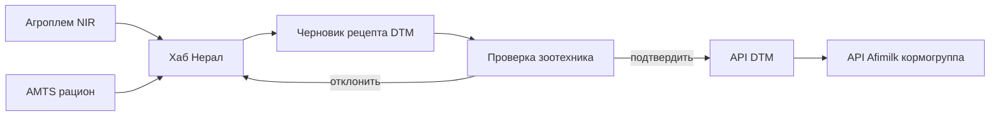

# Кормление: автоматический поток Матрикс → DTM → Afimilk

## Как было

1. **Агроплем** присылает PDF/бланк NIR (сенаж, силос и т.д.).
2. **AMTS (Кoudijs)** — рацион «раздой» с кг СВ и «как скормлено».
3. Зоотехник **вручную** переносит цифры в **DTM** (рецепт, ингредиенты, %СВ).
4. Кормогруппу в **Afimilk** меняют отдельно (связь с надоями / группами).

Модуль **4.2** в презентации Матрикс — как раз эта связка без ручного переписывания.

## Как должно быть (целевая схема)

### Этапы

| Шаг | Система | Данные |
|-----|---------|--------|
| 1 | Агроплем | %СВ, протеин, НДК, pH по партии корма |
| 2 | AMTS | список ингредиентов, кг СВ/КС на голову |
| 3 | Хаб | сопоставление кодов DTM ↔ названия AMTS, пересчёт кг/корова |
| 4 | UI проверки | таблица «было в DTM / предложение / Δ», флаги |
| 5 | DTM | запись рецепта, ревизия, включение замеса |
| 6 | Afimilk | обновление кормогруппы для стада |

## Демо в пульте (`/matrix/feeding`)

В `web-matrix` реализован **прототип шагов 1–4** с **двумя каналами загрузки**:

### 1 · Цифровая загрузка

- CSV Агроплем (шаблон можно скачать в UI);
- CSV AMTS / Koudijs;
- при несовпадении формата — демо-данные с пометкой.

### 2 · Фото с планшета

- кнопка **«Сделать фото»** (`capture=environment` — задняя камера на планшете);
- выбор типа бланка: Агроплем или AMTS;
- **«Распознать автоматически»** (демо-OCR по шаблону);
- правка полей и **«Применить к черновику»**;
- далее та же сверка с DTM и подтверждение зоотехником.

Общее для обоих каналов:

- карточки Агроплем + AMTS обновляются после применения;
- сверка с текущим DTM (подсветка изменений);
- галочки по строкам, «Подтвердить» / «Отклонить»;
- кнопки «Отправить в DTM» и «Afimilk» (пока только статус в браузере).

Код: `web-matrix/src/components/FeedingIntakePanel.tsx`, `web-matrix/src/data/feedingIntake.ts`.

## Что нужно от фермы для боевого внедрения

1. **DTM** — API или ODBC/экспорт рецептов и справочника ингредиентов (коды как в DTM).
2. **Afimilk** — read-only БД уже упоминалась; нужны поля кормогрупп и связь с рецептом.
3. **Агроплем** — цифровая выдача (CSV/XML) или OCR по PDF с валидацией.
4. **AMTS** — экспорт рациона (файл или API от Кoudijs).
5. **Справочник сопоставления** — одна таблица «название AMTS → код DTM → код Afimilk».

## Роли

- **Зоотехник** — подтверждает черновик, видит расхождения и комментарий.
- **ИТ** — доступы, сервер on-prem (рекомендация из презентации).

См. также `web-matrix/README.md` и модуль 4.2 в `docs/matrix-pdf-extract.txt`.
